# Git Hands-On Lab 3 – Branching and Merging

## Name

**Avni Sharma**

---

# Objective

* Understand Git branching and merging.
* Create and manage branches in Git.
* Make changes in a separate branch.
* Merge branch changes into the main branch.
* Delete a branch after successful merging.

---

# Branching

## Step 1: Create a New Branch

Created a new branch named `GitNewBranch`.

Commands executed:

```bash
git branch GitNewBranch
git branch -a
```

The branch list displays both local and remote branches. The `*` symbol indicates the current active branch.

### Screenshot

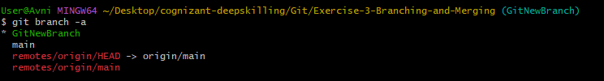

---

## Step 2: Switch to the New Branch

Switched from the main branch to `GitNewBranch`.

Command executed:

```bash
git checkout GitNewBranch
```

### Screenshot

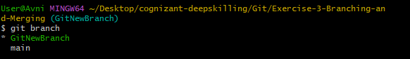

---

## Step 3: Add Changes in the Branch

Modified `BranchDemo.txt` by adding new content while working on `GitNewBranch`.

Commands executed:

```bash
echo "This change was made in GitNewBranch." >> BranchDemo.txt
cat BranchDemo.txt
```

### Screenshot

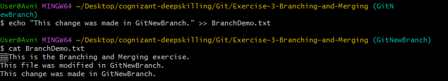

---

## Step 4: Verify Changes Using Git Status

Checked the current status of the working directory.

Command executed:

```bash
git status
```

### Screenshot

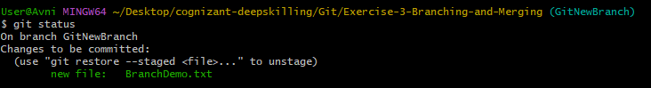

---

## Step 5: Commit Changes

The changes were added and committed to the branch.

Commands executed:

```bash
git add BranchDemo.txt
git commit -m "Added changes in GitNewBranch"
```

---

# Merging

## Step 6: Switch Back to Main Branch

Switched back to the main branch before merging.

Command executed:

```bash
git checkout main
```

### Screenshot

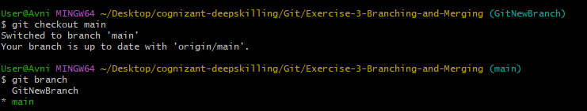

---

## Step 7: Compare Differences Between Branches

Checked the differences between the main branch and `GitNewBranch`.

Command executed:

```bash
git diff main GitNewBranch
```

### Screenshot

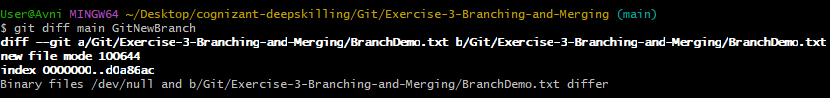

---

## Step 8: Merge Branch With Main

Merged the changes from `GitNewBranch` into the main branch.

Command executed:

```bash
git merge GitNewBranch
```

### Screenshot

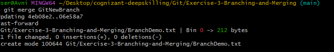

---

## Step 9: Verify Merged Changes

Checked the content of the file after merging.

Command executed:

```bash
cat BranchDemo.txt
```

### Screenshot

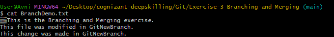

---

## Step 10: View Commit History

Observed the commit history after merging using graph view.

Command executed:

```bash
git log --oneline --graph --decorate
```

### Screenshot

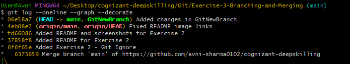

---

## Step 11: Delete the Branch

Deleted the branch after successful merging.

Command executed:

```bash
git branch -d GitNewBranch
```

### Screenshot

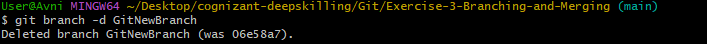

---

## Step 12: Verify Final Repository Status

Checked the final repository status and available branches.

Commands executed:

```bash
git status
git branch
```

The repository was clean and only the main branch remained.

### Screenshot

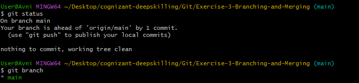

---

# Result

The branching and merging process was completed successfully.

A new branch was created, changes were committed, merged into the main branch, and the branch was deleted after merging.

---

# Conclusion

This hands-on exercise demonstrated how Git branches allow developers to work independently and how merging integrates changes back into the main branch. The exercise also covered branch management, comparison of changes, merging, and branch deletion.
