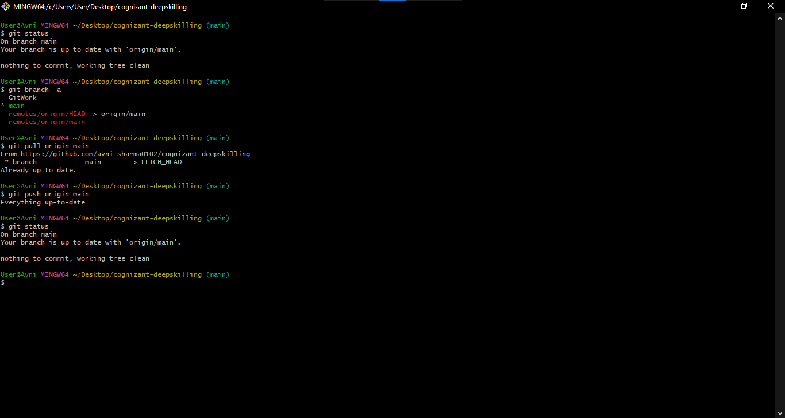

# Git Hands-On Lab 5 – Cleanup and Push Back to Remote Git

## Objective
To verify repository status, pull latest changes, and push changes to remote Git.

## Steps Performed

- Verified clean repository using git status.
- Listed available branches using git branch -a.
- Pulled latest changes from remote repository.
- Pushed changes to remote repository.
- Verified final clean status.

## Screenshot

## Result

Repository was successfully cleaned and synchronized with the remote repository.